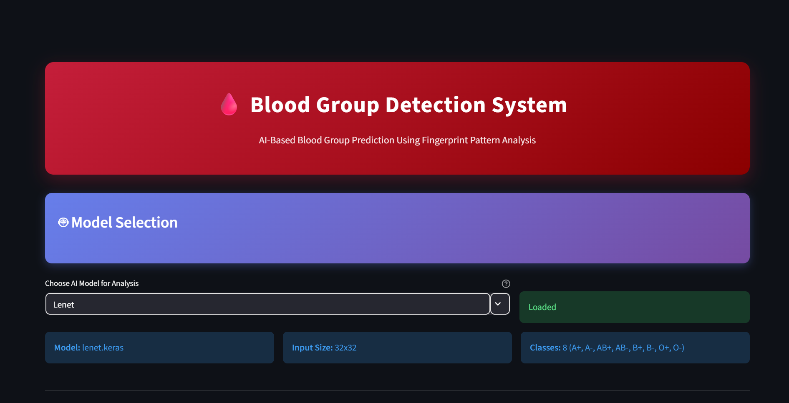
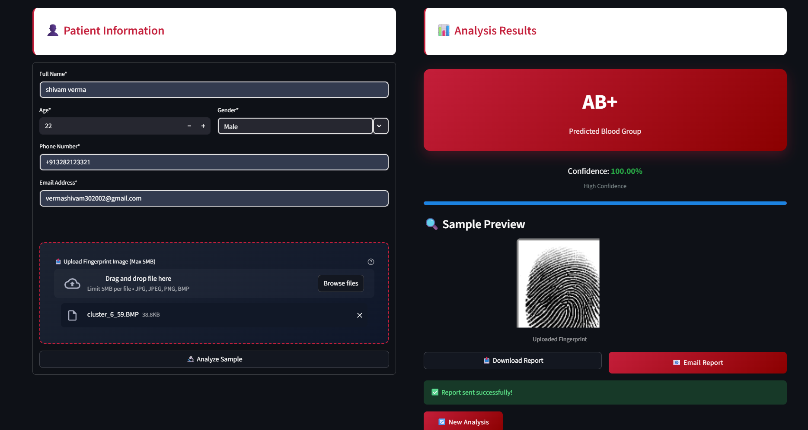
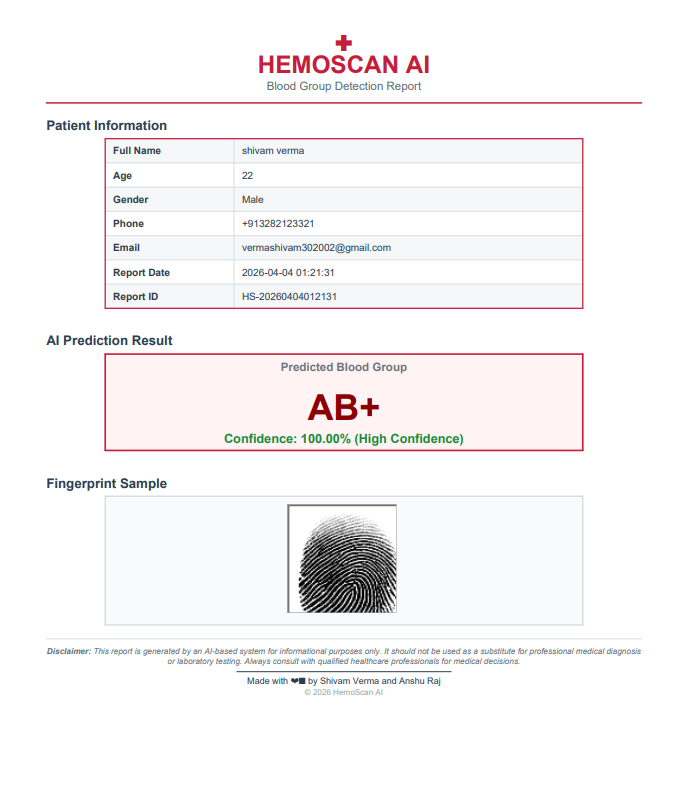

# AI-Based Blood Group Prediction Using Fingerprint Pattern Analysis

[](https://hemoscan.streamlit.app/)      

## 1. Project Title
**AI-Based Blood Group Prediction Using Fingerprint Pattern Analysis (HemoScan AI)**

## 2. Project Overview
HemoScan AI is an AI/ML research-driven web application that explores whether fingerprint ridge pattern characteristics can be used to predict human blood groups. The motivation behind this project is to investigate a fast, non-invasive, and computational approach for blood group inference using image-based biometric signals.

This work is based on the hypothesis that certain fingerprint pattern distributions may show statistical correlation with blood group classes (ABO and Rh). Using this research premise, deep learning models are trained to learn discriminative ridge-level and texture-level features from fingerprint images and map them to blood group categories.

The system accepts fingerprint images as input, applies preprocessing and model inference, and returns a predicted blood group with confidence score. HemoScan AI is designed as an **AI-based predictive research system** and is intended for academic and experimental use. It is **not** a replacement for certified medical diagnostics or laboratory blood typing.

## 3. Key Features
- AI-based fingerprint pattern analysis
- Multiple deep learning models trained and evaluated
- Model comparison and accuracy analysis
- Interactive web interface built with Streamlit
- Automated blood group prediction with confidence score
- Automatic PDF report generation
- Email-based report delivery
- Live web deployment for browser-based access

## 4. Live Demo
**Live Application:** https://hemoscan.streamlit.app

Users can open the deployed application in any modern browser, upload fingerprint images, and receive blood group predictions in real time without local setup.

## 5. Dataset
The project uses a class-wise fingerprint image dataset for supervised training. Each class corresponds to a blood group label.

### Expected dataset location
```text
dataset/
└── dataset_blood_group/
    ├── A-/
    ├── A+/
    ├── AB-/
    ├── AB+/
    ├── B-/
    ├── B+/
    ├── O-/
    └── O+/
```

Each class directory should contain fingerprint images belonging to that blood group class. For local execution or retraining, place the dataset exactly under the path shown above.

## 6. Deep Learning Models Used
Multiple deep learning architectures were trained and evaluated to study performance across CNN-based and transformer-based designs:

- **LeNet**
- **VGG16**
- **ResNet50**
- **Swin Transformer**

Extensive experimentation was performed to compare learning behavior, classification quality, and generalization performance across models. The **best-performing model was selected and deployed in the production system**.

## 7. Model Accuracy Comparison
The table below provides a template for reporting comparative model performance.

| Model | Accuracy | Notes |
|---|---:|---|
| LeNet | 82.92% | Baseline CNN |
| VGG16 | 87.67% | Deeper convolutional architecture |
| ResNet50 | 89.00% | Residual network with skip connections |
| Swin Transformer | 93.83% | Best performing model |

Based on experimentation, Swin Transformer achieved the highest predictive accuracy and was selected for deployment in the live system.

## 8. Project Architecture
The end-to-end pipeline is as follows:

**Fingerprint Image**  
→ **Image Preprocessing**  
→ **Deep Learning Model**  
→ **Blood Group Prediction**  
→ **Confidence Score**  
→ **Report Generation**  
→ **Email Delivery**

## 9. Folder Structure
Current repository layout:

```text
AI-Based-Blood-Group-Prediction-Using-Fingerprint-Pattern-Analysis/
├── app.py
├── requirements.txt
├── code/
│   ├── Lenet/
│   │   └── lenet.ipynb
│   ├── Resnet50/
│   │   └── Resnet50.ipynb
│   ├── swim/
│   │   └── swim.ipynb
│   └── Vgg16/
│       └── Vgg16.ipynb
├── dataset/
│   └── dataset_blood_group/
│       ├── A-/
│       ├── A+/
│       ├── AB-/
│       ├── AB+/
│       ├── B-/
│       ├── B+/
│       ├── O-/
│       └── O+/
├── images/
└── models/
    ├── lenet.keras
    ├── resnet50.keras
    ├── swin.pth
    └── vgg16.keras
```

- `dataset/` contains class-wise fingerprint images used for training and evaluation.
- `models/` stores trained model artifacts used for inference.
- `app.py` is the main Streamlit application entry point.
- `code/` contains model-specific training and experimentation notebooks.

## 10. Running the Project Locally
### Step 1: Clone the repository
```bash
git clone https://github.com/<shivamverma30>/AI-Based-Blood-Group-Prediction-Using-Fingerprint-Pattern-Analysis.git
cd AI-Based-Blood-Group-Prediction-Using-Fingerprint-Pattern-Analysis
```

### Step 2: Install dependencies
```bash
pip install -r requirements.txt
```

### Step 3: Place dataset and model files
Ensure the following paths are available:
- `dataset/dataset_blood_group/` (class folders with fingerprint images)
- `models/` (trained model files)

### Step 4: Run the Streamlit app
```bash
streamlit run app.py
```

Open the local URL shown in the terminal (commonly `http://localhost:8501`).

## 11. Model Training
Model development followed a standard supervised deep learning workflow:

- Image preprocessing and normalization of fingerprint inputs
- Dataset organization and class-wise labeling
- Train/validation/test split for robust evaluation
- CNN and transformer model training with hyperparameter tuning
- Performance evaluation using classification metrics (e.g., accuracy, confusion analysis)
- Cross-model comparison to select the most effective architecture

Multiple architectures were trained and compared before selecting the production model.

## 12. Screenshots
Add project screenshots in this section to improve visual documentation.

- **Application Interface**  
  

- **Prediction Result**  
  

- **Report Generation**  
  

## 13. Deployment
The production application is deployed using **Streamlit Cloud**.

For deployment efficiency and repository size management, the production setup automatically downloads the trained model artifact during startup (for example, from Google Drive).

## 14. Future Improvements
- Expand training with a larger and more diverse fingerprint dataset
- Improve model robustness and predictive accuracy
- Develop a mobile application interface for wider accessibility
- Integrate with healthcare information systems for workflow interoperability

## 15. Author
**Shivam Verma**

This project was developed as part of an academic final year AI/ML research project focused on applied deep learning for biometric-based predictive analytics.
